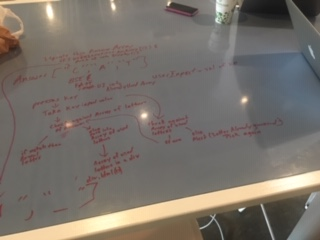
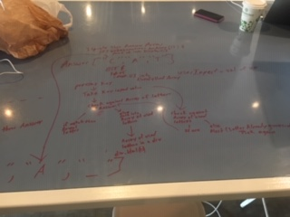
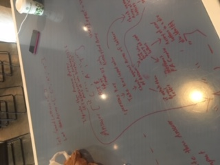

# Hangman
The objective for this game is to guess the word based off the category
The user is to select from the alphabet selection and the guess will either display in the guess word section or will result in a failure. after more than 6 failures the player will lose the game.

<!-- link to Trello Board -->
https://trello.com/b/VZ7oZFtc/game-project

<!-- link to Netlify  -->
https://focused-tereshkova-77418a.netlify.com/index.html

<!-- Wireframe Images -->

<!-- Whiteboarding Images -->

